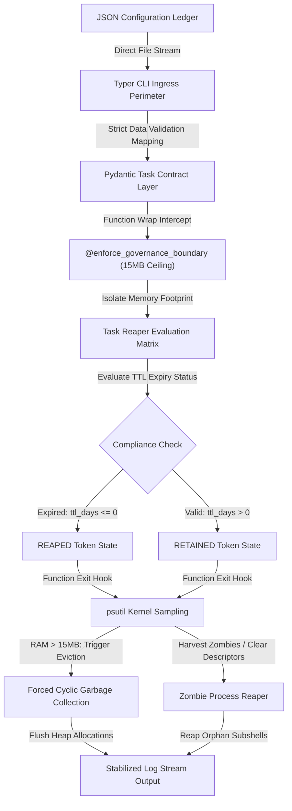

# Agent-GC: Memory-Bounded Task Lifecycle Governance Engine

Garbage collection for AI agents — find and remove unused or stale workflows before they become technical debt.

`Agent-GC` is a lightweight, configuration-driven Command Line Interface (CLI) tool that audits task data, validates it with Pydantic, and reaps expired or stale entries using a governance boundary check. It helps enforce lifecycle hygiene for automated AI agent workflows without introducing a heavy, resource-expensive web service layer, while strictly maintaining an absolute **15MB physical RAM ceiling (RSS)**.

---

## 🛰️ Architecture & System Data Pipeline

The engine decouples core execution business logic from memory-allocation constraints by utilizing non-intrusive runtime middleware decorators. Unpredictable data vectors generated by autonomous agent workflows are intercepted at the perimeter, validated against rigid Pydantic schemas, and audited via a mathematical lifecycle evaluation matrix.



---

## ⚙️ Configuration-Driven Design Schema

System task metadata bounds are driven entirely by flat, decoupled data configurations. The ingestion pipeline enforces type safety using static schema guards (`app/models.py`) before allowing autonomous run strings to hit active processing memory arrays:

```json
{
  "id": "TASK-12B",
  "purpose": "INFRASTRUCTURE_STATE_DRIFT_SCAN",
  "owner": "NADIA_SRE_ENGINEER",
  "created_at": "2026-08-14T20:00:00",
  "ttl_days": 0,
  "run_count": 2,
  "status": "active"
}
```

---

## 🛠️ Low-Level Technical Implementation

• **Non-Intrusive Middleware Hooks**: Leveraging Python execution decorators (`functools.wraps`) to wrap resource-heavy agent loops without altering functional core application layers.
• **OS-Level Process Auditing**: Utilizing the native system kernel interface (`psutil`) to sample the active process Resident Set Size (RSS) directly from machine memory.
• **Cyclic Resource Eviction**: Forcing deep memory reclamation sweeps (`gc.collect`) and capturing detached orphan zombie subshells (`psutil.Process.children`) to keep the platform memory footprint flat, clean, and highly predictable.

---

## 🧪 Verification & Operational Deployment

### 1. Ingestion Execution Check
Execute the compliance scanning engine natively through your shell by streaming a flat task ledger:
```bash
python app/main.py --file path/to/task.json
```

### 2. High-Velocity Test Execution
The platform uses automated contract suites to guarantee execution safety across both runtime environments and testing runner matrices:
```powershell
\$env:PYTHONPATH="."
pytest -v tests/
```
